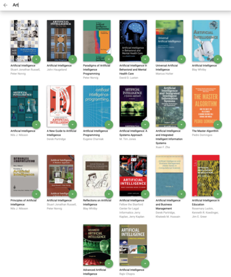

# MyReads

MyReads is a bookshelf application that allows a user to select and categorize books they have read, are currently reading, or want to read. This project uses React to build the application and an API server and client library that is used to persist information as the user interacts with the application.

## Preview
Home Page | Search Page
:-------------------------:|:-------------------------:
 | 

## Installation
1. Install all project dependencies with `npm install`
2. Start the development server with `npm start`

## Components
* Search: Manages the view of the search page
* Bookshelf: A title, and _ListBooks_
* ListBooks: A List of books that will be displayed in a Grid
* Book: The main item displayed, a book with an image, title, and author


## File Structure
```bash
├── CONTRIBUTING.md
├── README.md - This file.
├── SEARCH_TERMS.md # The whitelisted short collection of available search terms
├── package.json # npm package manager file
├── public
│   ├── favicon.ico # React Icon
│   └── index.html
└── src
    ├── App.css # Styles for the app
    ├── App.js # Root of the app
    ├── BooksAPI.js
    ├── icons # Images for the app
    │   ├── add.svg
    │   ├── arrow-back.svg
    │   └── arrow-drop-down.svg
    ├── index.css # Global styles
    └── index.js # Used for DOM rendering only.
```

## Backend Server

[`BooksAPI.js`](src/BooksAPI.js) contains the methods needed to perform necessary operations on the backend:

* [`getAll`](#getall)
* [`update`](#update)
* [`search`](#search)

### `getAll`

Method Signature:

```js
getAll()
```

* Returns a Promise which resolves to a JSON object containing a collection of book objects.
* This collection represents the books currently in the bookshelves in your app.

### `update`

Method Signature:

```js
update(book, shelf)
```

* book: `<Object>` containing at minimum an `id` attribute
* shelf: `<String>` contains one of ["wantToRead", "currentlyReading", "read"]  
* Returns a Promise which resolves to a JSON object containing the response data of the POST request

### `search`

Method Signature:

```js
search(query)
```

* query: `<String>`
* Returns a Promise which resolves to a JSON object containing a collection of a maximum of 20 book objects.
* These books do not know which shelf they are on. They are raw results only. You'll need to make sure that books have the correct state while on the search page.

## Important
The backend API uses a fixed set of cached search results and is limited to a particular set of search terms, which can be found in [SEARCH_TERMS.md](SEARCH_TERMS.md). That list of terms are the _only_ terms that will work with the backend.
